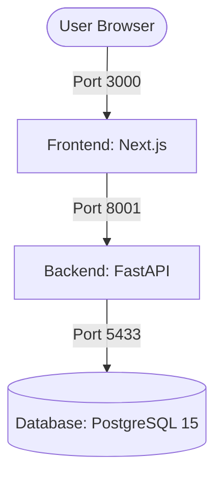

# Docker Development Environment Setup

This document provides guideance on running the **Job Scraper Monorepo** locally using Docker and Docker Compose. The environment consists of a Next.js frontend, a FastAPI backend, and a PostgreSQL database.

---

## 🏗️ Architecture Overview

The application is containerized using **Docker Compose** with three interconnected services:



| Service | Technology | Port (Host:Internal) | Description |
| :--- | :--- | :--- | :--- |
| **db** | PostgreSQL 15 | `5433:5432` | Stores scraped job data. |
| **backend** | FastAPI (Python 3.12) | `8001:8000` | Exposes REST APIs, runs scraper, and queries database. |
| **frontend** | Next.js (Node 22) | `3000:3000` | Main user interface. |

---

## 🛠️ Prerequisites

Ensure you have the following installed on your system:
- **Docker** (v20.10+)
- **Docker Compose** (v2.0+)

---

## 🔑 Environment Configuration

Create a `.env` file in the root directory (same folder as `docker-compose.yml`) containing the required environment variables:

```ini
# DeepSeek API Key (Required for the scraping LLM)
DEEPSEEK_API_KEY=your_deepseek_api_key_here
```

The database connection string is pre-configured in `docker-compose.yml` to automatically connect to the `db` service container:
`DATABASE_URL=postgresql://postgres:password@db:5432/jobsdb`

---

## 🚀 Getting Started

### 1. Build and Start the Containers
To build the images and run the services in the background:
```bash
docker compose up --build -d
```

### 2. View Service Status
Check the status of running containers:
```bash
docker compose ps
```

### 3. Check Live Logs
To tail the logs of all services (or specify a service name like `backend` or `frontend`):
```bash
# View all logs
docker compose logs -f

# View backend logs only
docker compose logs -f backend
```

### 4. Stop the Containers
To stop the services while preserving database data:
```bash
docker compose down
```

To stop the services and **delete all database volumes** (warning: resets the database):
```bash
docker compose down -v
```

---

## 📦 Service Details

### 🔹 PostgreSQL Database (`db`)
- **Docker Image**: `postgres:15`
- **Volume Mount**: `postgres_data` persists data across container restarts.
- **Port**: Exposed on port `5433` on the host to avoid conflicts with default local PostgreSQL instances running on `5432`.
- **Healthcheck**: Uses `pg_isready` to block the backend until the database is fully ready to accept connections.

### 🔹 FastAPI Backend (`backend`)
- **Base Image**: `python:3.12-slim`
- **Scraper Setup**: Automatically installs system dependencies (`build-essential`, `libpq-dev`, `curl`) and the Playwright Chromium browser dependencies required by the ScrapeGraph-AI engine.
- **Live Reload**: Source code is volume-mounted (`./backend:/app`), allowing local Python changes to hot-reload immediately inside the container.

### 🔹 Next.js Frontend (`frontend`)
- **Base Image**: `node:22-alpine`
- **Live Reload**: Source code is volume-mounted (`./frontend:/app`), enabling instant hot-reloading for UI development.

---

## 🔍 Troubleshooting

### ❌ DB Port Conflict
If you receive an error about port `5433` being already in use, verify if another process is utilizing it or change the port mapping in `docker-compose.yml`:
```yaml
ports:
  - "5434:5432" # Example: change host port to 5434
```

### ❌ Backend fails to start (Playwright issue)
If the backend crashes on scraping tasks, it may be due to missing browser dependencies. Re-build the image to guarantee Playwright packages are installed:
```bash
docker compose build --no-cache backend
```

### 🔄 Resetting database schema
If you make migrations or want to wipe the database and start fresh:
```bash
docker compose down -v
docker compose up --build -d
```
